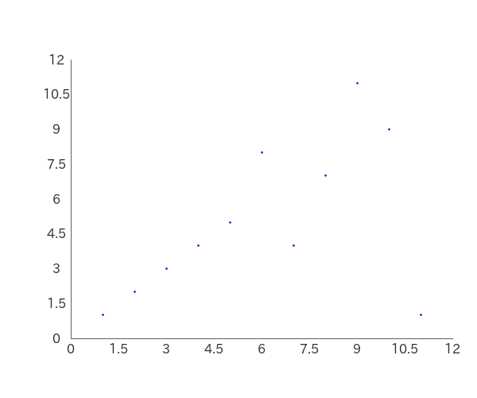
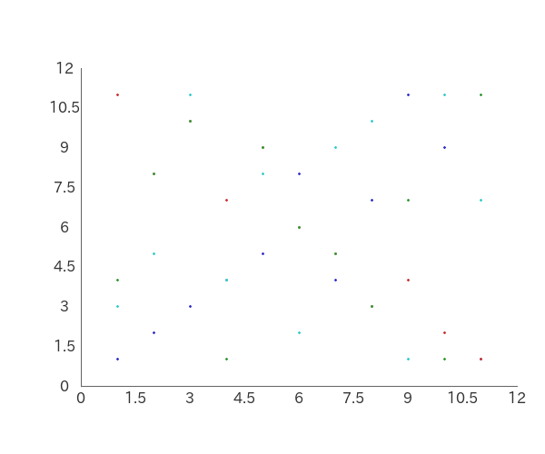

# PHP-Scatterplot

PHP-Scatterplot is a tool for creating scatter plots.

You can also retrieve parsed data:

Mean, Variance, Standard Deviation, Covariance,
 
Correlation Coefficient and Regression Line Formula.


## Contents

- [Installation](#installation)
- [Usage](#usage)
    - [Basic Usage](#basic-usage)
    - [Using Layers](#using-layers)
    - [Changing Properties](#changing-properties)
    - [Parsed Data](#parsed-data)
- [Example](#example)
- [License](#license)

## Installation

```bash
composer require macocci7/php-scatterplot
```

## Usage

### Basic Usage

- PHP

    ```php
    <?php
    require('../vendor/autoload.php');

    use Macocci7\PhpScatterplot\Scatterplot;

    $sp = new Scatterplot();

    $layers = [
        [
            'x' => [1,2,3,4,5,6,7,8,9,10,11],
            'y' => [1,2,3,4,5,8,4,7,11,9,1],
        ],
    ];

    $sp->layers($layers)
        ->create('img/BasicUsage.png');
    ```

- Result

    

### Using Layers

- PHP

    ```php
    <?php
    require('../vendor/autoload.php');

    use Macocci7\PhpScatterplot\Scatterplot;

    $sp = new Scatterplot();

    $layers = [
        'John' => [
            'x' => [1,2,3,4,5,6,7,8,9,10,11],
            'y' => [1,2,3,4,5,8,4,7,11,9,1],
        ],
        'Jake' => [
            'x' => [1,2,3,4,5,6,7,8,9,10,11],
            'y' => [11,8,10,7,9,6,5,3,4,2,1],
        ],
        'Hugo' => [
            'x' => [1,2,3,4,5,6,7,8,9,10,11],
            'y' => [4,8,10,1,9,6,5,3,7,1,11],
        ],
        'Alex' => [
            'x' => [1,2,3,4,5,6,7,8,9,10,11],
            'y' => [3,5,11,4,8,2,9,10,1,11,7],
        ],
    ];

    $legends = array_keys($layers);

    $sp->layers($layers)
        ->create('img/UsingLayers.png');
    ```

- Result

    

### Changing Properties

- PHP

    ```php
    <?php
    require('../vendor/autoload.php');

    use Macocci7\PhpScatterplot\Scatterplot;

    $sp = new Scatterplot();

    $layers = [
        'John' => [
            'x' => [1,2,3,4,5,6,7,8,9,10,11],
            'y' => [1,2,3,4,5,8,4,7,11,9,1],
        ],
        'Jake' => [
            'x' => [1,2,3,4,5,6,7,8,9,10,11],
            'y' => [11,8,10,7,9,6,5,3,4,2,1],
        ],
        'Hugo' => [
            'x' => [1,2,3,4,5,6,7,8,9,10,11],
            'y' => [4,8,10,1,9,6,5,3,7,1,11],
        ],
        'Alex' => [
            'x' => [1,2,3,4,5,6,7,8,9,10,11],
            'y' => [3,5,11,4,8,2,9,10,1,11,7],
        ],
    ];

    $legends = array_keys($layers);

    $sp->layers($layers)
        ->limitX(0, 12)
        ->limitY(0, 12)
        ->gridXPitch(2)
        ->gridYPitch(2)
        ->bgcolor('#ccccff')
        ->colors(['#ffffff'])
        ->plotSize(4)
        ->fontColor('#333333')
        ->grid(1, '#999999')
        ->gridXOn()
        ->gridYOn()
        ->regressionLine(3, ['#666666', '#cc2222', '#2222cc', '#22cc22'])
        ->referenceLineX(1.5, 1, '#00ccff')
        ->referenceLineY(1.5, 1, '#00ccff')
        ->specificationLimitX(0.5, 11.5, 1, '#ff00ff')
        ->specificationLimitY(0.5, 11.5, 1, '#ff00ff')
        ->labelX('DATA X')
        ->labelY('DATA Y')
        ->caption('SCATTER PLOT')
        ->legends($legends)
        ->create('img/ChangingProperties.png');
    ```

- Result

    

### Parsed Data

- PHP

    ```php
    <?php
    require('../vendor/autoload.php');

    use Macocci7\PhpScatterplot\Analyzer;

    $a = new Analyzer();

    $layers = [
        'John' => [
            'x' => [1,2,3,4,5,6,7,8,9,10,11],
            'y' => [1,2,3,4,5,8,4,7,11,9,1],
        ],
        'Jake' => [
            'x' => [1,2,3,4,5,6,7,8,9,10,11],
            'y' => [11,8,10,7,9,6,5,3,4,2,1],
        ],
    ];

    var_dump($a->parse($layers));
    ```

- Result

    ```bash
    array(2) {
        ["John"]=>
        array(6) {
            ["count"]=>
            int(11)
            ["x"]=>
            array(5) {
                ["Mean"]=>
                int(6)
                ["Max"]=>
                int(11)
                ["Min"]=>
                int(1)
                ["Variance"]=>
                int(10)
                ["StandardDeviation"]=>
                float(3.1622776601683795)
            }
            ["y"]=>
            array(5) {
                ["Mean"]=>
                int(5)
                ["Max"]=>
                int(11)
                ["Min"]=>
                int(1)
                ["Variance"]=>
                float(10.181818181818182)
                ["StandardDeviation"]=>
                float(3.1908961408698624)
            }
            ["Covariance"]=>
            float(5.181818181818182)
            ["CorrelationCoefficient"]=>
            float(0.5135343537364686)
            ["RegressionLineFormula"]=>
            array(2) {
                ["a"]=>
                float(0.5181818181818182)
                ["b"]=>
                float(1.8909090909090907)
            }
        }
        ["Jake"]=>
        array(6) {
            ["count"]=>
            int(11)
            ["x"]=>
            array(5) {
                ["Mean"]=>
                int(6)
                ["Max"]=>
                int(11)
                ["Min"]=>
                int(1)
                ["Variance"]=>
                int(10)
                ["StandardDeviation"]=>
                float(3.1622776601683795)
            }
            ["y"]=>
            array(5) {
                ["Mean"]=>
                int(6)
                ["Max"]=>
                int(11)
                ["Min"]=>
                int(1)
                ["Variance"]=>
                int(10)
                ["StandardDeviation"]=>
                float(3.1622776601683795)
            }
            ["Covariance"]=>
            float(-9.454545454545455)
            ["CorrelationCoefficient"]=>
            float(-0.9454545454545453)
            ["RegressionLineFormula"]=>
            array(2) {
                ["a"]=>
                float(-0.9454545454545455)
                ["b"]=>
                float(11.672727272727274)
            }
        }
    }
    ```

## Example

- [BasicUsage.php](example/BasicUsage.php) >> results in [BasicUsage.md](example/BasicUsage.md)
- [UsingLayers.php](example/UsingLayers.php) >> results in [UsingLayers.md](example/UsingLayers.md)
- [ChangingProperties.php](example/ChangingProperties.php) >> results in [ChangingProperties.md](example/ChangingProperties.md)
- [ParsedData.php](example/ParsedData.php) >> results in [ParsedData.txt](example/ParsedData.txt)

## License

[MIT](LICENSE)

***

*Document written: 2023/06/06*

*Document updated: 2023/06/07*

Copyright 2023 macocci7.
