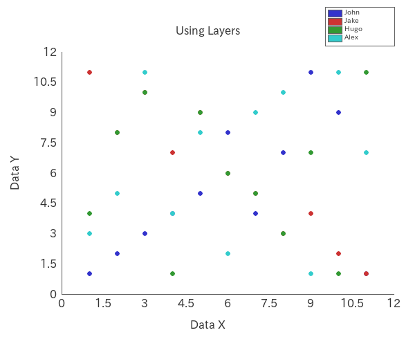

# PHP-Scatterplot

## 1. Features

`PHP-Scatterplot` is a PHP library for creating scatter plots easily.

You can also retrieve parsed data:

`Mean`, `Variance`, `Standard Deviation`, `Covariance`,
 
`Correlation Coefficient` and `Regression Line Formula`.

`Reference Line` and `Specification Limits` are supported.

`Multiple Layers (Data Sets)` are supported.


## Contents

- [1. Features](#1-features)
- 2\. Contents
- [3. Requirements](#3-requirements)
- [4. Installation](#4-installation)
- [5. Usage](#5-usage)
    - [5.1. Basic Usage](#51-basic-usage)
    - [5.2. Using Layers](#52-using-layers)
    - [5.3. Adjusting the Display By Methods](#53-adjusting-the-display-by-methods)
    - [5.4. Adjusting the Display By Neon File](#54-adjusting-the-display-by-neon-file)
    - [5.5. Adjusting the Display By Array](#55-adjusting-the-display-by-array)
    - [5.6. Transparent Background](#56-transparent-background)
    - [5.7. Parsed Data](#57-parsed-data)
- [6. Examples](#6-examples)
- [7. License](#7-license)

## 3. Requirements

- PHP 8.1 or later
- Imagick PHP Extension

    Check with commands:
    ```php
    php -i | grep imagick
    ```
- Composer

## 4. Installation

```bash
composer require macocci7/php-scatterplot
```

## 5. Usage

- [5.1. Basic Usage](#51-basic-usage)
- [5.2. Using Layers](#52-using-layers)
- [5.3. Adjusting the Display By Methods](#53-adjusting-the-display-by-methods)
- [5.4. Adjusting the Display By Neon File](#54-adjusting-the-display-by-neon-file)
- [5.5. Adjusting the Display By Array](#55-adjusting-the-display-by-array)
- [5.6. Transparent Background](#56-transparent-background)
- [5.7. Parsed Data](#57-parsed-data)

### 5.1. Basic Usage

- PHP: [examples/BasicUsage.php](examples/BasicUsage.php)

    ```php
    <?php

    require_once __DIR__ . '/../vendor/autoload.php';

    use Macocci7\PhpScatterplot\Scatterplot;

    $layers = [
        [
            'x' => [ 1, 2, 3, 4, 5, 6, 7, 8, 9, 10, 11, ],
            'y' => [ 1, 2, 3, 4, 5, 8, 4, 7, 11, 9, 1, ],
        ],
    ];

    $sp = new Scatterplot();
    $sp->layers($layers)
        ->create('img/BasicUsage.png');
    ```

- Result: [examples/img/BasicUsage.png](examples/img/BasicUsage.png)

    <a href="examples/img/BasicUsage.png"></a>

- Details:
    - Import Autoloader: `require_once __DIR__ . '/../vendor/autoload.php'`
    - Declare: `use Macocci7\PhpScatterplot`
    - Prepare Data: `$layers = [ $layer ]`
        - `$layers`: `array<int|string, array<string, list<int|float>>>`
        - `$layer`: `array<string, list<int|float>>`
        - `$layer` must have hash keys of `x` and `y`.
        - Hash arrays `x` and `y` must have the same number of elements.
    - Instantiate: `new Scatterplot()`
    - Set Data: `layers($layers)`
    - Create Image: `create($path)`

### 5.2. Using Layers

- PHP: [examples/UsingLayers.php](examples/UsingLayers.php)

    ```php
    <?php

    require_once __DIR__ . '/../vendor/autoload.php';

    use Macocci7\PhpScatterplot\Scatterplot;

    $layers = [
        'John' => [
            'x' => [ 1, 2, 3, 4, 5, 6, 7, 8, 9, 10, 11, ],
            'y' => [ 1, 2, 3, 4, 5, 8, 4, 7, 11, 9, 1, ],
        ],
        'Jake' => [
            'x' => [ 1, 2, 3, 4, 5, 6, 7, 8, 9, 10, 11, ],
            'y' => [ 11, 8, 10, 7, 9, 6, 5, 3, 4, 2, 1, ],
        ],
        'Hugo' => [
            'x' => [ 1, 2, 3, 4, 5, 6, 7, 8, 9, 10, 11, ],
            'y' => [ 4, 8, 10, 1, 9, 6, 5, 3, 7, 1, 11, ],
        ],
        'Alex' => [
            'x' => [ 1, 2, 3, 4, 5, 6, 7, 8, 9, 10, 11, ],
            'y' => [ 3, 5, 11, 4, 8, 2, 9, 10, 1, 11, 7, ],
        ],
    ];

    $legends = array_keys($layers);

    $sp = new Scatterplot();
    $sp->layers($layers)
       ->plotSize(6)
       ->legends($legends)
       ->labelX('Data X')
       ->labelY('Data Y')
       ->caption('Using Layers')
       ->create('img/UsingLayers.png');
    ```

- Result: [examples/img/UsingLayers.png](examples/img/UsingLayers.png)

    <a href="examples/img/UsingLayers.png"></a>

- Details:
    - Change Plot Size (Diameter): `plotSize(int $pixSize)`
    - Set Legend Labels: `legends(string[] $legends)`
    - Set Label for X Axis: `labelX(string $labelX)`
    - Set Label for Y Axis: `labelY(string $labelY)`
    - Set Caption: `caption(string $caption)`

### 5.3. Adjusting the Display By Methods

- PHP: [examples/AdjustDisplayByMethods.php](examples/AdjustDisplayByMethods.php)

    ```php
    <?php

    require_once __DIR__ . '/../vendor/autoload.php';

    use Macocci7\PhpScatterplot\Scatterplot;

    $layers = [
        'John' => [
            'x' => [ 1, 2, 3, 4, 5, 6, 7, 8, 9, 10, 11, ],
            'y' => [ 1, 2, 3, 4, 5, 8, 4, 7, 11, 9, 1, ],
        ],
        'Jake' => [
            'x' => [ 1, 2, 3, 4, 5, 6, 7, 8, 9, 10, 11, ],
            'y' => [ 11, 8, 10, 7, 9, 6, 5, 3, 4, 2, 1, ],
        ],
        'Hugo' => [
            'x' => [ 1, 2, 3, 4, 5, 6, 7, 8, 9, 10, 11, ],
            'y' => [ 4, 8, 10, 1, 9, 6, 5, 3, 7, 1, 11, ],
        ],
        'Alex' => [
            'x' => [ 1, 2, 3, 4, 5, 6, 7, 8, 9, 10, 11, ],
            'y' => [ 3, 5, 11, 4, 8, 2, 9, 10, 1, 11, 7, ],
        ],
    ];

    $legends = array_keys($layers);

    $sp = new Scatterplot();
    $sp->layers($layers)
       ->limitX(0, 12)
       ->limitY(0, 12)
       ->gridXPitch(2)
       ->gridYPitch(2)
       ->bgcolor('#ccccff')
       ->colors(['#ffffff'])
       ->plotSize(4)
       ->fontColor('#333333')
       ->grid(1, '#999999')
       ->gridXOn()
       ->gridYOn()
       ->regressionLine(3, [ '#666666', '#cc2222', '#2222cc', '#22cc22', ])
       ->referenceLineX(1.5, 1, '#00ccff')
       ->referenceLineY(1.5, 1, '#00ccff')
       ->specificationLimitX(0.5, 11.5, 1, '#ff00ff')
       ->specificationLimitY(0.5, 11.5, 1, '#ff00ff')
       ->labelX('DATA X')
       ->labelY('DATA Y')
       ->caption('SCATTER PLOT')
       ->legends($legends)
       ->create('img/AdjustDisplayByMethods.png');
    ```

- Result: [examples/img/AdjustDisplayByMethods.png](examples/img/AdjustDisplayByMethods.png)

    <a href="examples/img/AdjustDisplayByMethods.png"></a>

- Details:
    <table>
    <tr><th>Available Method</th></tr>
    <tr><td>limitX(int|float $lower, int|float $upper)</td></tr>
    <tr><td>limitY(int|float $lower, int|float $upper)</td></tr>
    <tr><td>resize(int $width, int $height)</td></tr>
    <tr><td>frame($xRatio, $yRatio)</td></tr>
    <tr><td>bgcolor(string|null $color = null)</td></tr>
    <tr><td>axis(int $width, string|null $color = null)</td></tr>
    <tr><td>grid(int $width, string|null $color = null)</td></tr>
    <tr><td>gridXPitch(int|float $pitch)</td></tr>
    <tr><td>gridYPitch(int|float $pitch)</td></tr>
    <tr><td>colors(array $colors)</td></tr>
    <tr><td>plotSize(int $size)</td></tr>
    <tr><td>fontPath(string $path)</td></tr>
    <tr><td>fontSize(int|float $size)</td></tr>
    <tr><td>fontColor(string $color)</td></tr>
    <tr><td>referenceLineX(int|float $x, int $width = 1, string $color = '#0000ff')</td></tr>
    <tr><td>referenceLineY(int|float $y, int $width = 1, string $color = '#0000ff')</td></tr>
    <tr><td>specificationLimitX(int|float $lower, int|float $upper, int $width = 1, string $color = '#ff00ff')</td></tr>
    <tr><td>specificationLimitY(int|float $lower, int|float $upper, int $width = 1, string $color = '#ff00ff')</td></tr>
    <tr><td>regressionLine(int $width, array $colors)</td></tr>
    <tr><td>labelX(string $label)</td></tr>
    <tr><td>labelY(string $label)</td></tr>
    <tr><td>caption(string $caption)</td></tr>
    <tr><td>legends(array $legends)</td></tr>
    <tr><td>gridXOn()</td></tr>
    <tr><td>gridXOff()</td></tr>
    <tr><td>gridYOn()</td></tr>
    <tr><td>gridYOff()</td></tr>
    <tr><td>referenceLineXOff()</td></tr>
    <tr><td>referenceLineYOff()</td></tr>
    <tr><td>referenceLinesOff()</td></tr>
    <tr><td>specificationLimitXOff()</td></tr>
    <tr><td>specificationLimitYOff()</td></tr>
    <tr><td>specificationLimitsOff()</td></tr>
    <tr><td>regressionLineOn()</td></tr>
    <tr><td>regressionLineOff()</td></tr>
    <tr><td>legendOff()</td></tr>
    </table>

### 5.4. Adjusting the Display By Neon File

First, prepare a Neon file like this:

- Neon: [examples/AdjustDisplayByNeon.neon](examples/AdjustDisplayByNeon.neon)

    ```neon
    #canvasWidth: 600
    #canvasHeight: 500
    canvasBackgroundColor: '#ccccff'
    #frameXRatio: 0.8
    #frameYRatio: 0.7
    #axisColor: '#666666'
    #axisWidth: 1
    gridColor: '#999999'
    #gridWidth: 1
    gridXPitch: 2
    gridYPitch: 2
    gridX: true
    gridY: true
    xLimitUpper: 12
    xLimitLower: 0
    yLimitUpper: 12
    yLimitLower: 0
    plotDiameter: 6
    #fontPath: 'fonts/ipaexg.ttf' # IPA ex Gothic 00401
    #fontSize: 16
    #fontColor: '#333333'
    referenceLineX: true
    referenceLineXValue: 1.5
    referenceLineXWidth: 1
    referenceLineXColor: '#009933'
    referenceLineY: true
    referenceLineYValue: 1.5
    referenceLineYWidth: 1
    referenceLineYColor: '#009933'
    specificationLimitX: true
    specificationLimitXLower: 0.5
    specificationLimitXUpper: 11.5
    specificationLimitXWidth: 1
    specificationLimitXColor: '#ff00ff'
    specificationLimitY: true
    specificationLimitYLower: 0.5
    specificationLimitYUpper: 11.5
    specificationLimitYWidth: 1
    specificationLimitYColor: '#ff00ff'
    regressionLine: true
    regressionLineWidth: 3
    labelX: 'DATA X'
    labelY: 'DATA Y'
    caption: 'Adjusting the Display By Neon File'
    legend: true
    legends: [ 'John', 'Jake', 'Hugo', 'Alex', ]
    legendWidth: 100
    legendFontSize: 10
    colors:
        - '#3333cc'
        - '#cc3333'
        - '#339933'
        - '#33cccc'
        - '#cc3333'
        - '#ffcc33'
        - '#cccc33'
        - '#cc33cc'
    regressionLineColors:
        - '#2222cc'
        - '#cc2222'
        - '#22cc22'
        - '#22cccc'
    ```

Second, Code PHP like this:

- PHP: [examples/AdjustDisplayByNeon.php](examples/AdjustDisplayByNeon.php)

    ```php
    <?php

    require_once __DIR__ . '/../vendor/autoload.php';

    use Macocci7\PhpScatterplot\Scatterplot;

    $layers = [
        'John' => [
            'x' => [ 1, 2, 3, 4, 5, 6, 7, 8, 9, 10, 11, ],
            'y' => [ 1, 2, 3, 4, 5, 8, 4, 7, 11, 9, 1, ],
        ],
        'Jake' => [
            'x' => [ 1, 2, 3, 4, 5, 6, 7, 8, 9, 10, 11, ],
            'y' => [ 11, 8, 10, 7, 9, 6, 5, 3, 4, 2, 1, ],
        ],
        'Hugo' => [
            'x' => [ 1, 2, 3, 4, 5, 6, 7, 8, 9, 10, 11, ],
            'y' => [ 4, 8, 10, 1, 9, 6, 5, 3, 7, 1, 11, ],
        ],
        'Alex' => [
            'x' => [ 1, 2, 3, 4, 5, 6, 7, 8, 9, 10, 11, ],
            'y' => [ 3, 5, 11, 4, 8, 2, 9, 10, 1, 11, 7, ],
        ],
    ];

    $sp = new Scatterplot();
    $sp->layers($layers)
       ->config('AdjustDisplayByNeon.neon')
       ->create('img/AdjustDisplayByNeon.png');
    ```

Then, run the PHP code.

- Result: [examples/img/AdjustDisplayByNeon.png](examples/img/AdjustDisplayByNeon.png)

    <a href="examples/img/AdjustDisplayByNeon.png"></a>

### 5.5. Adjusting the Display By Array

- PHP: [examples/AdjustDisplayByArray.php](examples/AdjustDisplayByArray.php)

    ```php
    <?php

    require_once __DIR__ . '/../vendor/autoload.php';

    use Macocci7\PhpScatterplot\Scatterplot;

    $layers = [
        'John' => [
            'x' => [ 1, 2, 3, 4, 5, 6, 7, 8, 9, 10, 11, ],
            'y' => [ 1, 2, 3, 4, 5, 8, 4, 7, 11, 9, 1, ],
        ],
        'Jake' => [
            'x' => [ 1, 2, 3, 4, 5, 6, 7, 8, 9, 10, 11, ],
            'y' => [ 11, 8, 10, 7, 9, 6, 5, 3, 4, 2, 1, ],
        ],
        'Hugo' => [
            'x' => [ 1, 2, 3, 4, 5, 6, 7, 8, 9, 10, 11, ],
            'y' => [ 4, 8, 10, 1, 9, 6, 5, 3, 7, 1, 11, ],
        ],
        'Alex' => [
            'x' => [ 1, 2, 3, 4, 5, 6, 7, 8, 9, 10, 11, ],
            'y' => [ 3, 5, 11, 4, 8, 2, 9, 10, 1, 11, 7, ],
        ],
    ];

    $conf = [
        //'canvasWidth' => 600,
        //'canvasHeight' => 500,
        'canvasBackgroundColor' => '#ccccff',
        //'frameXRatio' => 0.8,
        //'frameYRatio' => 0.7,
        //'axisColor' => '#666666',
        //'axisWidth' => 1,
        'gridColor' => '#999999',
        //'gridWidth' => 1,
        'gridXPitch' => 2,
        'gridYPitch' => 2,
        'gridX' => true,
        'gridY' => true,
        'xLimitUpper' => 12,
        'xLimitLower' => 0,
        'yLimitUpper' => 12,
        'yLimitLower' => 0,
        'plotDiameter' => 6,
        //'fontPath' => 'fonts/ipaexg.ttf', // IPA ex Gothic 00401
        //'fontSize' => 16,
        //'fontColor' => '#333333',
        'referenceLineX' => true,
        'referenceLineXValue' => 1.5,
        'referenceLineXWidth' => 1,
        'referenceLineXColor' => '#009933',
        'referenceLineY' => true,
        'referenceLineYValue' => 1.5,
        'referenceLineYWidth' => 1,
        'referenceLineYColor' => '#009933',
        'specificationLimitX' => true,
        'specificationLimitXLower' => 0.5,
        'specificationLimitXUpper' => 11.5,
        'specificationLimitXWidth' => 1,
        'specificationLimitXColor' => '#ff00ff',
        'specificationLimitY' => true,
        'specificationLimitYLower' => 0.5,
        'specificationLimitYUpper' => 11.5,
        'specificationLimitYWidth' => 1,
        'specificationLimitYColor' => '#ff00ff',
        'regressionLine' => true,
        'regressionLineWidth' => 3,
        'labelX' => 'DATA X',
        'labelY' => 'DATA Y',
        'caption' => 'Adjusting the Display By Neon File',
        'legend' => true,
        'legends' => [ 'John', 'Jake', 'Hugo', 'Alex', ],
        'legendWidth' => 100,
        'legendFontSize' => 10,
        'colors' => [
            '#3333cc',
            '#cc3333',
            '#339933',
            '#33cccc',
            '#cc3333',
            '#ffcc33',
            '#cccc33',
            '#cc33cc',
        ],
        'regressionLineColors' => [
            '#2222cc',
            '#cc2222',
            '#22cc22',
            '#22cccc',
        ],
    ];

    $sp = new Scatterplot();
    $sp->layers($layers)
       ->config($conf)
       ->create('img/AdjustDisplayByArray.png');
    ```

- Result: [examples/img/AdjustDisplayByArray.png](examples/img/AdjustDisplayByArray.png)

    <a href="examples/img/AdjustDisplayByArray.png"></a>

### 5.6. Transparent Background

- PHP: [examples/TransparentBackground.php](examples/TransparentBackground.php)

    ```php
    <?php

    require_once __DIR__ . '/../vendor/autoload.php';

    use Macocci7\PhpScatterplot\Scatterplot;

    $layers = [
        'John' => [
            'x' => [ 1, 2, 3, 4, 5, 6, 7, 8, 9, 10, 11, ],
            'y' => [ 1, 2, 3, 4, 5, 8, 4, 7, 11, 9, 1, ],
        ],
        'Jake' => [
            'x' => [ 1, 2, 3, 4, 5, 6, 7, 8, 9, 10, 11, ],
            'y' => [ 11, 8, 10, 7, 9, 6, 5, 3, 4, 2, 1, ],
        ],
        'Hugo' => [
            'x' => [ 1, 2, 3, 4, 5, 6, 7, 8, 9, 10, 11, ],
            'y' => [ 4, 8, 10, 1, 9, 6, 5, 3, 7, 1, 11, ],
        ],
        'Alex' => [
            'x' => [ 1, 2, 3, 4, 5, 6, 7, 8, 9, 10, 11, ],
            'y' => [ 3, 5, 11, 4, 8, 2, 9, 10, 1, 11, 7, ],
        ],
    ];

    $sp = new Scatterplot();
    $sp->layers($layers)
       ->config('AdjustDisplayByNeon.neon')
       ->config([
           // This results in transparent backgournd
           'canvasBackgroundColor' => null,
       ])
       ->create('img/TransparentBackground.png');
    ```

- Result: [examples/img/TransparentBackground.png](examples/img/TransparentBackground.png)

    <a href="examples/img/TransparentBackground.png"></a>

### 5.7. Parsed Data

- PHP: [examples/ParsedData.php](examples/ParsedData.php)

    ```php
    <?php

    require_once __DIR__ . '/../vendor/autoload.php';

    use Macocci7\PhpScatterplot\Analyzer;

    $a = new Analyzer();

    $layers = [
        'John' => [
            'x' => [1,2,3,4,5,6,7,8,9,10,11],
            'y' => [1,2,3,4,5,8,4,7,11,9,1],
        ],
        'Jake' => [
            'x' => [1,2,3,4,5,6,7,8,9,10,11],
            'y' => [11,8,10,7,9,6,5,3,4,2,1],
        ],
    ];

    var_dump($a->parse($layers));
    ```

- Result: [examples/ParsedData.txt](examples/ParsedData.txt)

    ```bash
    array(2) {
      ["John"]=>
      array(6) {
        ["count"]=>
        int(11)
        ["x"]=>
        array(5) {
          ["Mean"]=>
          int(6)
          ["Max"]=>
          int(11)
          ["Min"]=>
          int(1)
          ["Variance"]=>
          int(10)
          ["StandardDeviation"]=>
          float(3.1622776601683795)
        }
        ["y"]=>
        array(5) {
          ["Mean"]=>
          int(5)
          ["Max"]=>
          int(11)
          ["Min"]=>
          int(1)
          ["Variance"]=>
          float(10.181818181818182)
          ["StandardDeviation"]=>
          float(3.1908961408698624)
        }
        ["Covariance"]=>
        float(5.181818181818182)
        ["CorrelationCoefficient"]=>
        float(0.5135343537364686)
        ["RegressionLineFormula"]=>
        array(2) {
          ["a"]=>
          float(0.5181818181818182)
          ["b"]=>
          float(1.8909090909090907)
        }
      }
      ["Jake"]=>
      array(6) {
        ["count"]=>
        int(11)
        ["x"]=>
        array(5) {
          ["Mean"]=>
          int(6)
          ["Max"]=>
          int(11)
          ["Min"]=>
          int(1)
          ["Variance"]=>
          int(10)
          ["StandardDeviation"]=>
          float(3.1622776601683795)
        }
        ["y"]=>
        array(5) {
          ["Mean"]=>
          int(6)
          ["Max"]=>
          int(11)
          ["Min"]=>
          int(1)
          ["Variance"]=>
          int(10)
          ["StandardDeviation"]=>
          float(3.1622776601683795)
        }
        ["Covariance"]=>
        float(-9.454545454545455)
        ["CorrelationCoefficient"]=>
        float(-0.9454545454545453)
        ["RegressionLineFormula"]=>
        array(2) {
          ["a"]=>
          float(-0.9454545454545455)
          ["b"]=>
          float(11.672727272727274)
        }
      }
    }
    ```

## 6. Examples

- [BasicUsage.php](examples/BasicUsage.php) >> results in [BasicUsage.md](examples/BasicUsage.md)
- [UsingLayers.php](examples/UsingLayers.php) >> results in [UsingLayers.md](examples/UsingLayers.md)
- [AdjustDisplayByMethods.php](examples/AdjustDisplayByMethods.php) >> results in [AdjustDisplayByMethods.md](examples/AdjustDisplayByMethods.md)
- [AdjustDisplayByNeon.php](examples/AdjustDisplayByNeon.php) >> results in:

    <a href="examples/img/AdjustDisplayByNeon.png"></a>

- [AdjustDisplayByArray.php](examples/AdjustDisplayByArray.php) >> results in:

    <a href="examples/img/AdjustDisplayByArray.png"></a>

- [TransparentBackground.php](examples/TransparentBackground.php) >> results in:

    <a href="examples/img/TransparentBackground.png"></a>

- [ParsedData.php](example/ParsedData.php) >> results in [ParsedData.txt](example/ParsedData.txt)
- [Matrix.php](example/Matrix.php) >> results in [Matrix.md](example/Matrix.md)

## 7. License

[MIT](LICENSE)

***

*Document written: 2023/06/06*

*Document updated: 2025/01/04*

Copyright 2023 - 2025 macocci7.
