# Scatterplot Matrix: Weather in Tokyo

## Data Source

<a href='https://www.data.jma.go.jp/gmd/risk/obsdl/' target='_blank'>Japan Meteorological Agency</a>

## Period: 2023/5/9～2023/6/9
<table>
<tr>
<th>＼</th>
<th>Mean Temperature(℃)</th>
<th>Maximum Temperature(℃)</th>
<th>Minimum Temperature(℃)</th>
<th>Sunshine Hours(h)</th>
<th>Precipitation Amount(mm)</th>
<th>Mean Local Air Pressure(hPa)</th>
</tr>
<tr><td>Mean Temperature(℃)</td>
<td>-</td>
<td><a href="img/Matrix00.png">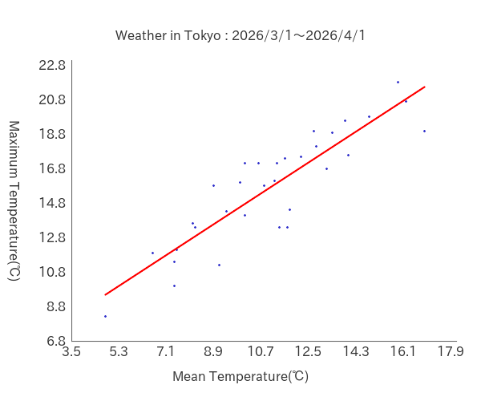</a> 

Properties

- count: 32
- x: 
	- Mean: 19.809375
	- Max: 25.4
	- Min: 13.9
	- Variance: 6.748974609375
	- StandardDeviation: 2.5978788673406
- y: 
	- Mean: 24.7375
	- Max: 32.2
	- Min: 17.2
	- Variance: 13.52796875
	- StandardDeviation: 3.678038709693
- Covariance: 8.4012109375
- CorrelationCoefficient: 0.87923849923656
- RegressionLineFormula: 
	- a: 1.2448129417808
	- b: 0.078533631411009

</td>
<td><a href="img/Matrix01.png">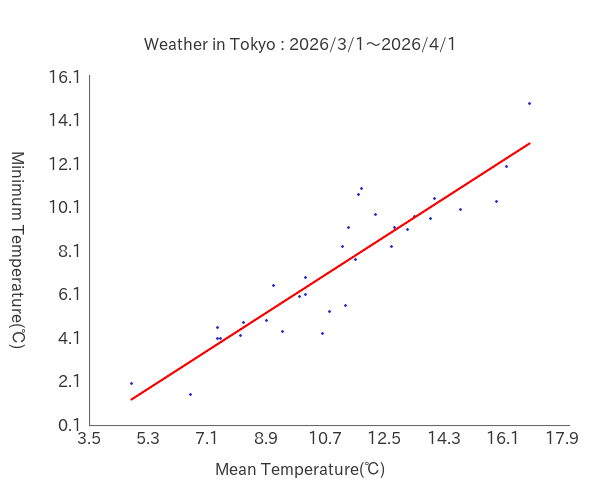</a> 

Properties

- count: 32
- x: 
	- Mean: 19.809375
	- Max: 25.4
	- Min: 13.9
	- Variance: 6.748974609375
	- StandardDeviation: 2.5978788673406
- y: 
	- Mean: 15.596875
	- Max: 19.7
	- Min: 10.1
	- Variance: 6.726552734375
	- StandardDeviation: 2.5935598574884
- Covariance: 5.047841796875
- CorrelationCoefficient: 0.74918756880131
- RegressionLineFormula: 
	- a: 0.74794203401848
	- b: 0.7806107698652

</td>
<td><a href="img/Matrix02.png">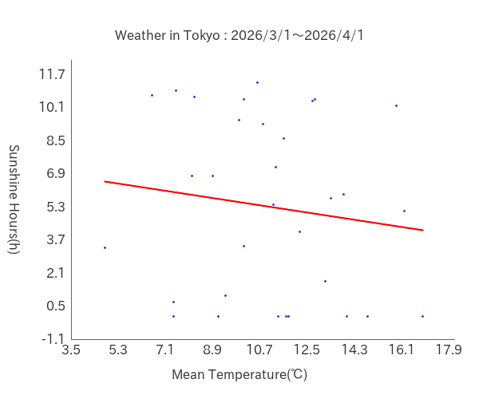</a> 

Properties

- count: 32
- x: 
	- Mean: 19.809375
	- Max: 25.4
	- Min: 13.9
	- Variance: 6.748974609375
	- StandardDeviation: 2.5978788673406
- y: 
	- Mean: 5.653125
	- Max: 13.3
	- Min: 0
	- Variance: 21.256240234375
	- StandardDeviation: 4.6104490274132
- Covariance: 3.206064453125
- CorrelationCoefficient: 0.26767642720506
- RegressionLineFormula: 
	- a: 0.47504467547877
	- b: -3.7572131183122

</td>
<td><a href="img/Matrix03.png">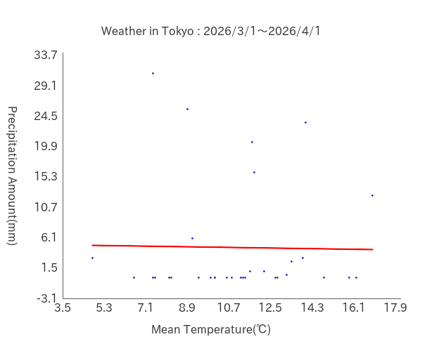</a> 

Properties

- count: 32
- x: 
	- Mean: 19.809375
	- Max: 25.4
	- Min: 13.9
	- Variance: 6.748974609375
	- StandardDeviation: 2.5978788673406
- y: 
	- Mean: 11.828125
	- Max: 168.5
	- Min: 0
	- Variance: 1067.1970214844
	- StandardDeviation: 32.667981594895
- Covariance: 3.190673828125
- CorrelationCoefficient: 0.037595962749643
- RegressionLineFormula: 
	- a: 0.47276423646532
	- b: 2.4629609532698

</td>
<td><a href="img/Matrix04.png">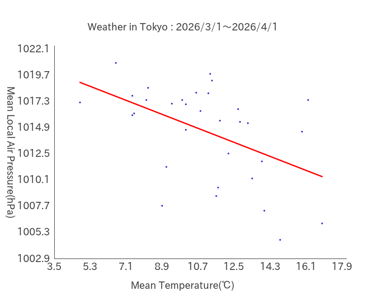</a> 

Properties

- count: 32
- x: 
	- Mean: 19.809375
	- Max: 25.4
	- Min: 13.9
	- Variance: 6.748974609375
	- StandardDeviation: 2.5978788673406
- y: 
	- Mean: 1009.31875
	- Max: 1021.3
	- Min: 997
	- Variance: 36.3283984375
	- StandardDeviation: 6.0273044088962
- Covariance: -3.43767578125
- CorrelationCoefficient: -0.21954466663638
- RegressionLineFormula: 
	- a: -0.50936267806886
	- b: 1019.4089063009

</td>
</tr>
<tr><td>Maximum Temperature(℃)</td>
<td>-</td>
<td>-</td>
<td><a href="img/Matrix05.png">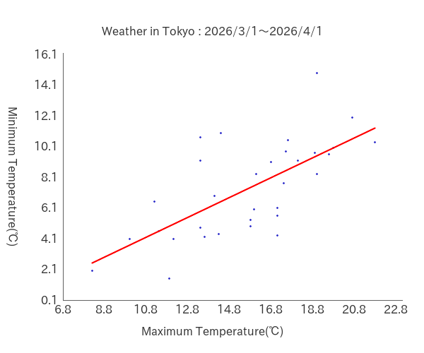</a> 

Properties

- count: 32
- x: 
	- Mean: 24.7375
	- Max: 32.2
	- Min: 17.2
	- Variance: 13.52796875
	- StandardDeviation: 3.678038709693
- y: 
	- Mean: 15.596875
	- Max: 19.7
	- Min: 10.1
	- Variance: 6.726552734375
	- StandardDeviation: 2.5935598574884
- Covariance: 3.6088671875
- CorrelationCoefficient: 0.37831915261387
- RegressionLineFormula: 
	- a: 0.26677081047367
	- b: 8.9976320759076

</td>
<td> 

Properties

- count: 32
- x: 
	- Mean: 24.7375
	- Max: 32.2
	- Min: 17.2
	- Variance: 13.52796875
	- StandardDeviation: 3.678038709693
- y: 
	- Mean: 5.653125
	- Max: 13.3
	- Min: 0
	- Variance: 21.256240234375
	- StandardDeviation: 4.6104490274132
- Covariance: 10.1048828125
- CorrelationCoefficient: 0.59589777078761
- RegressionLineFormula: 
	- a: 0.74696231187701
	- b: -12.824855190058

</td>
<td><a href="img/Matrix07.png">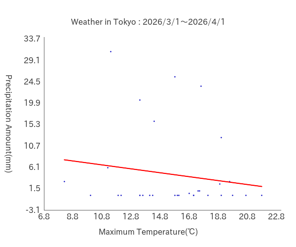</a> 

Properties

- count: 32
- x: 
	- Mean: 24.7375
	- Max: 32.2
	- Min: 17.2
	- Variance: 13.52796875
	- StandardDeviation: 3.678038709693
- y: 
	- Mean: 11.828125
	- Max: 168.5
	- Min: 0
	- Variance: 1067.1970214844
	- StandardDeviation: 32.667981594895
- Covariance: -18.7919921875
- CorrelationCoefficient: -0.15639909125761
- RegressionLineFormula: 
	- a: -1.3891214959748
	- b: 46.191518006676

</td>
<td> 

Properties

- count: 32
- x: 
	- Mean: 24.7375
	- Max: 32.2
	- Min: 17.2
	- Variance: 13.52796875
	- StandardDeviation: 3.678038709693
- y: 
	- Mean: 1009.31875
	- Max: 1021.3
	- Min: 997
	- Variance: 36.3283984375
	- StandardDeviation: 6.0273044088962
- Covariance: -1.944453125
- CorrelationCoefficient: -0.08771180661176
- RegressionLineFormula: 
	- a: -0.14373577888402
	- b: 1012.8744138301

</td>
</tr>
<tr><td>Minimum Temperature(℃)</td>
<td>-</td>
<td>-</td>
<td>-</td>
<td><a href="img/Matrix09.png">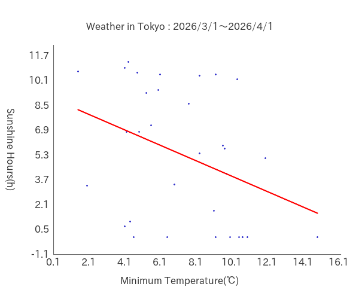</a> 

Properties

- count: 32
- x: 
	- Mean: 15.596875
	- Max: 19.7
	- Min: 10.1
	- Variance: 6.726552734375
	- StandardDeviation: 2.5935598574884
- y: 
	- Mean: 5.653125
	- Max: 13.3
	- Min: 0
	- Variance: 21.256240234375
	- StandardDeviation: 4.6104490274132
- Covariance: -4.230458984375
- CorrelationCoefficient: -0.35379198363538
- RegressionLineFormula: 
	- a: -0.62891932189216
	- b: 15.462301048637

</td>
<td><a href="img/Matrix10.png">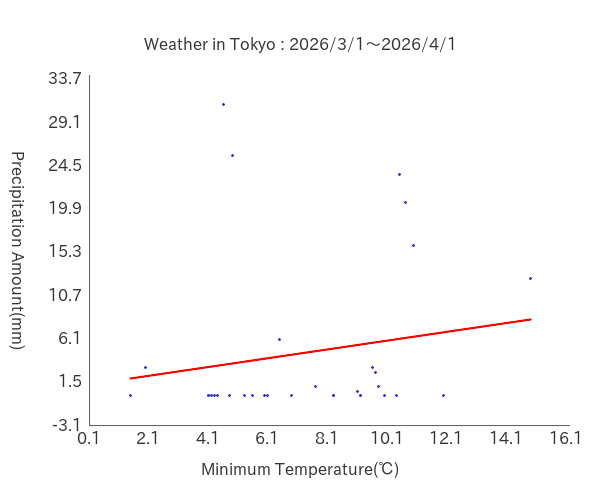</a> 

Properties

- count: 32
- x: 
	- Mean: 15.596875
	- Max: 19.7
	- Min: 10.1
	- Variance: 6.726552734375
	- StandardDeviation: 2.5935598574884
- y: 
	- Mean: 11.828125
	- Max: 168.5
	- Min: 0
	- Variance: 1067.1970214844
	- StandardDeviation: 32.667981594895
- Covariance: 28.621337890625
- CorrelationCoefficient: 0.33780910649999
- RegressionLineFormula: 
	- a: 4.2549785931745
	- b: -54.536244245418

</td>
<td><a href="img/Matrix11.png">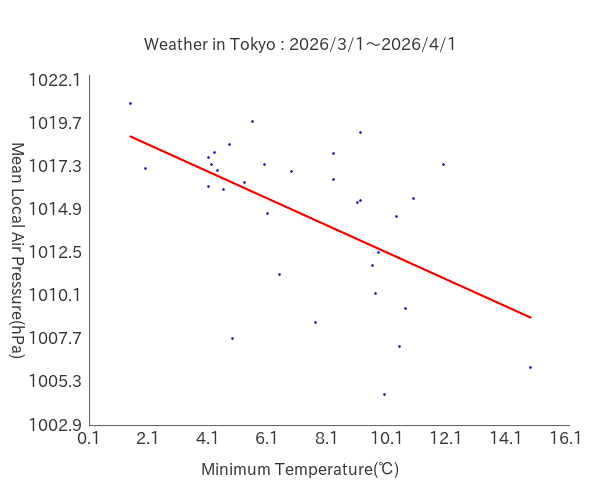</a> 

Properties

- count: 32
- x: 
	- Mean: 15.596875
	- Max: 19.7
	- Min: 10.1
	- Variance: 6.726552734375
	- StandardDeviation: 2.5935598574884
- y: 
	- Mean: 1009.31875
	- Max: 1021.3
	- Min: 997
	- Variance: 36.3283984375
	- StandardDeviation: 6.0273044088962
- Covariance: -6.01619140625
- CorrelationCoefficient: -0.38485952832303
- RegressionLineFormula: 
	- a: -0.89439444598497
	- b: 1023.2685083747

</td>
</tr>
<tr><td>Sunshine Hours(h)</td>
<td>-</td>
<td>-</td>
<td>-</td>
<td>-</td>
<td><a href="img/Matrix12.png">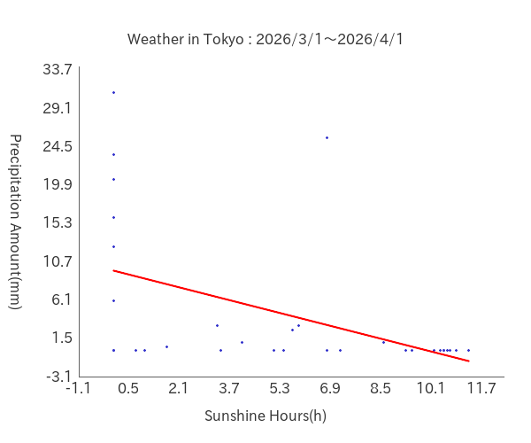</a> 

Properties

- count: 32
- x: 
	- Mean: 5.653125
	- Max: 13.3
	- Min: 0
	- Variance: 21.256240234375
	- StandardDeviation: 4.6104490274132
- y: 
	- Mean: 11.828125
	- Max: 168.5
	- Min: 0
	- Variance: 1067.1970214844
	- StandardDeviation: 32.667981594895
- Covariance: -50.076806640625
- CorrelationCoefficient: -0.33248426687446
- RegressionLineFormula: 
	- a: -2.3558637881615
	- b: 25.14611747745

</td>
<td><a href="img/Matrix13.png">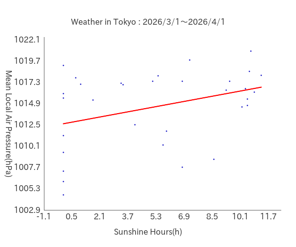</a> 

Properties

- count: 32
- x: 
	- Mean: 5.653125
	- Max: 13.3
	- Min: 0
	- Variance: 21.256240234375
	- StandardDeviation: 4.6104490274132
- y: 
	- Mean: 1009.31875
	- Max: 1021.3
	- Min: 997
	- Variance: 36.3283984375
	- StandardDeviation: 6.0273044088962
- Covariance: 8.34587890625
- CorrelationCoefficient: 0.30033484911277
- RegressionLineFormula: 
	- a: 0.39263194310127
	- b: 1007.0991525467

</td>
</tr>
<tr><td>Precipitation Amount(mm)</td>
<td>-</td>
<td>-</td>
<td>-</td>
<td>-</td>
<td>-</td>
<td><a href="img/Matrix14.png">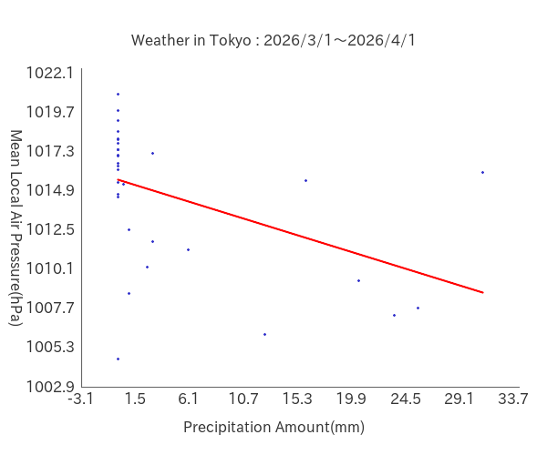</a> 

Properties

- count: 32
- x: 
	- Mean: 11.828125
	- Max: 168.5
	- Min: 0
	- Variance: 1067.1970214844
	- StandardDeviation: 32.667981594895
- y: 
	- Mean: 1009.31875
	- Max: 1021.3
	- Min: 997
	- Variance: 36.3283984375
	- StandardDeviation: 6.0273044088962
- Covariance: -94.59990234375
- CorrelationCoefficient: -0.48044674984083
- RegressionLineFormula: 
	- a: -0.088643334304072
	- b: 1010.3672344386

</td>
</tr>
<tr><td>Mean Local Air Pressure(hPa)</td>
<td>-</td>
<td>-</td>
<td>-</td>
<td>-</td>
<td>-</td>
<td>-</td>
</tr>
</table>
