# Scatterplot Matrix: Weather in Tokyo

## Data Source

<a href='https://www.data.jma.go.jp/gmd/risk/obsdl/' target='_blank'>Japan Meteorological Agency</a>

## Period: 2026/3/1～2026/4/1
<table>
<tr>
<th>＼</th>
<th>Mean Temperature(℃)</th>
<th>Maximum Temperature(℃)</th>
<th>Minimum Temperature(℃)</th>
<th>Sunshine Hours(h)</th>
<th>Precipitation Amount(mm)</th>
<th>Mean Local Air Pressure(hPa)</th>
</tr>
<tr><td>Mean Temperature(℃)</td>
<td>-</td>
<td><a href="img/Matrix00.png">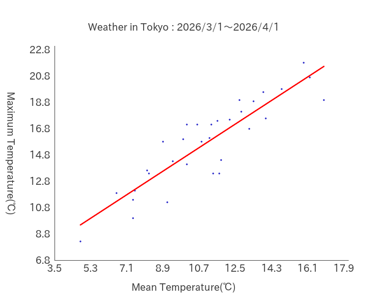</a> 

Properties

- count: 32
- x: 
	- Mean: 11.059375
	- Max: 16.9
	- Min: 4.8
	- Variance: 8.230537109375
	- StandardDeviation: 2.8688912683082
- y: 
	- Mean: 15.70625
	- Max: 21.8
	- Min: 8.2
	- Variance: 10.3274609375
	- StandardDeviation: 3.213636715234
- Covariance: 8.19619140625
- CorrelationCoefficient: 0.88899889832395
- RegressionLineFormula: 
	- a: 0.99582703987983
	- b: 4.693025330829

</td>
<td><a href="img/Matrix01.png">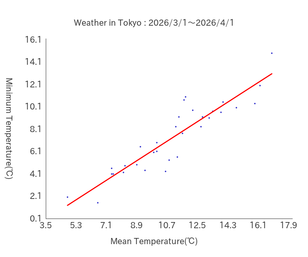</a> 

Properties

- count: 32
- x: 
	- Mean: 11.059375
	- Max: 16.9
	- Min: 4.8
	- Variance: 8.230537109375
	- StandardDeviation: 2.8688912683082
- y: 
	- Mean: 7.365625
	- Max: 14.9
	- Min: 1.5
	- Variance: 9.417880859375
	- StandardDeviation: 3.0688566045638
- Covariance: 8.038291015625
- CorrelationCoefficient: 0.9130047572481
- RegressionLineFormula: 
	- a: 0.97664233923069
	- b: -3.4354288704294

</td>
<td><a href="img/Matrix02.png">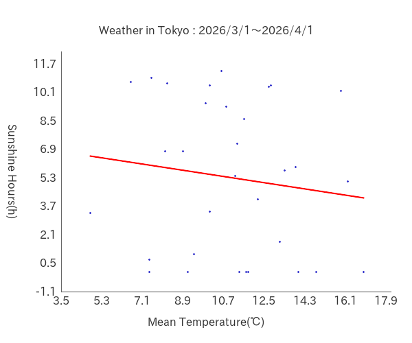</a> 

Properties

- count: 32
- x: 
	- Mean: 11.059375
	- Max: 16.9
	- Min: 4.8
	- Variance: 8.230537109375
	- StandardDeviation: 2.8688912683082
- y: 
	- Mean: 5.3
	- Max: 11.3
	- Min: 0
	- Variance: 17.759375
	- StandardDeviation: 4.2141873475203
- Covariance: -1.6240625
- CorrelationCoefficient: -0.13433055557756
- RegressionLineFormula: 
	- a: -0.19732156946964
	- b: 7.4822532323533

</td>
<td><a href="img/Matrix03.png">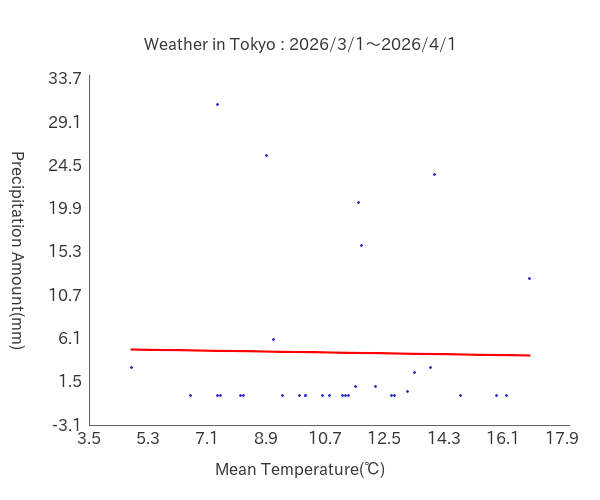</a> 

Properties

- count: 32
- x: 
	- Mean: 11.059375
	- Max: 16.9
	- Min: 4.8
	- Variance: 8.230537109375
	- StandardDeviation: 2.8688912683082
- y: 
	- Mean: 4.5625
	- Max: 31
	- Min: 0
	- Variance: 74.76171875
	- StandardDeviation: 8.6464859191466
- Covariance: -0.4630859375
- CorrelationCoefficient: -0.018668433012608
- RegressionLineFormula: 
	- a: -0.056264364202006
	- b: 5.1847487028466

</td>
<td><a href="img/Matrix04.png">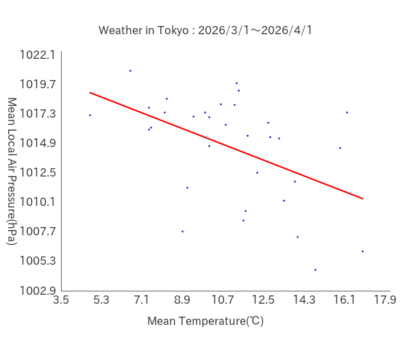</a> 

Properties

- count: 32
- x: 
	- Mean: 11.059375
	- Max: 16.9
	- Min: 4.8
	- Variance: 8.230537109375
	- StandardDeviation: 2.8688912683082
- y: 
	- Mean: 1014.55625
	- Max: 1020.8
	- Min: 1004.6
	- Variance: 17.8293359375
	- StandardDeviation: 4.2224798326931
- Covariance: -5.87771484375
- CorrelationCoefficient: -0.48520675658624
- RegressionLineFormula: 
	- a: -0.71413502735502
	- b: 1022.4541370682

</td>
</tr>
<tr><td>Maximum Temperature(℃)</td>
<td>-</td>
<td>-</td>
<td><a href="img/Matrix05.png">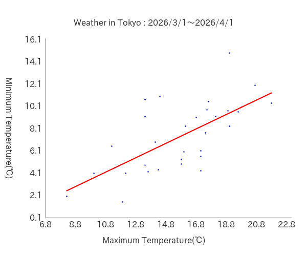</a> 

Properties

- count: 32
- x: 
	- Mean: 15.70625
	- Max: 21.8
	- Min: 8.2
	- Variance: 10.3274609375
	- StandardDeviation: 3.213636715234
- y: 
	- Mean: 7.365625
	- Max: 14.9
	- Min: 1.5
	- Variance: 9.417880859375
	- StandardDeviation: 3.0688566045638
- Covariance: 6.69771484375
- CorrelationCoefficient: 0.67913056515729
- RegressionLineFormula: 
	- a: 0.64853451243083
	- b: -2.8204201858667

</td>
<td><a href="img/Matrix06.png">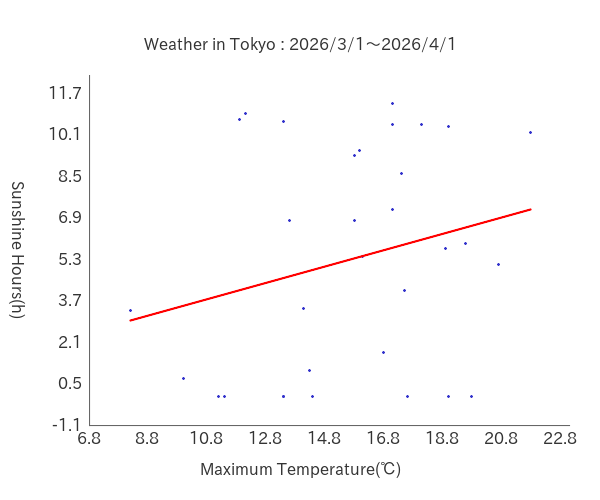</a> 

Properties

- count: 32
- x: 
	- Mean: 15.70625
	- Max: 21.8
	- Min: 8.2
	- Variance: 10.3274609375
	- StandardDeviation: 3.213636715234
- y: 
	- Mean: 5.3
	- Max: 11.3
	- Min: 0
	- Variance: 17.759375
	- StandardDeviation: 4.2141873475203
- Covariance: 3.261875
- CorrelationCoefficient: 0.2408555703511
- RegressionLineFormula: 
	- a: 0.31584481604339
	- b: 0.33926235801848

</td>
<td><a href="img/Matrix07.png">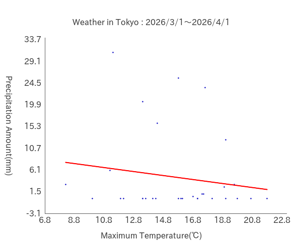</a> 

Properties

- count: 32
- x: 
	- Mean: 15.70625
	- Max: 21.8
	- Min: 8.2
	- Variance: 10.3274609375
	- StandardDeviation: 3.213636715234
- y: 
	- Mean: 4.5625
	- Max: 31
	- Min: 0
	- Variance: 74.76171875
	- StandardDeviation: 8.6464859191466
- Covariance: -4.358203125
- CorrelationCoefficient: -0.15684513368402
- RegressionLineFormula: 
	- a: -0.4220014146144
	- b: 11.190559718287

</td>
<td><a href="img/Matrix08.png">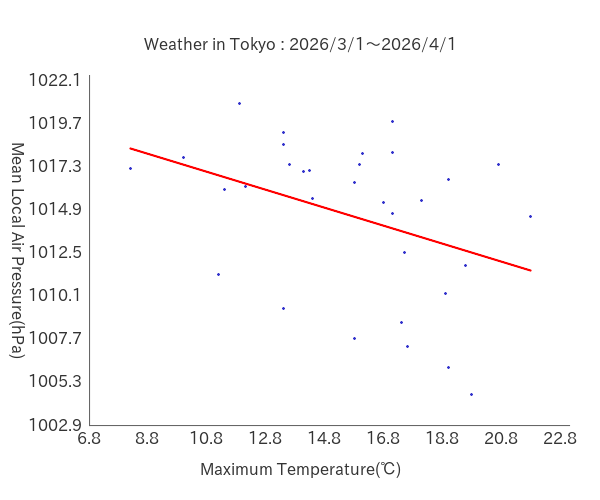</a> 

Properties

- count: 32
- x: 
	- Mean: 15.70625
	- Max: 21.8
	- Min: 8.2
	- Variance: 10.3274609375
	- StandardDeviation: 3.213636715234
- y: 
	- Mean: 1014.55625
	- Max: 1020.8
	- Min: 1004.6
	- Variance: 17.8293359375
	- StandardDeviation: 4.2224798326931
- Covariance: -5.1691015625
- CorrelationCoefficient: -0.38093484534136
- RegressionLineFormula: 
	- a: -0.50052007882504
	- b: 1022.417543488

</td>
</tr>
<tr><td>Minimum Temperature(℃)</td>
<td>-</td>
<td>-</td>
<td>-</td>
<td><a href="img/Matrix09.png">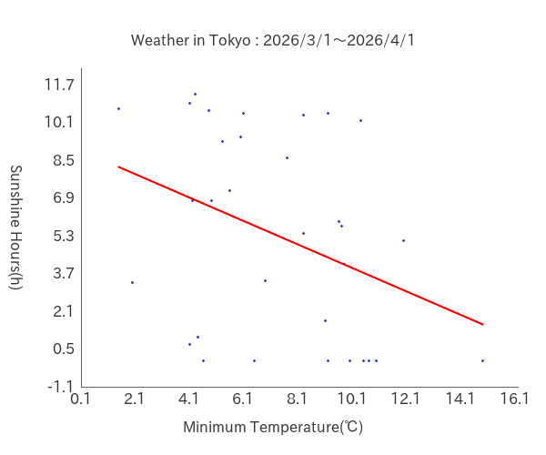</a> 

Properties

- count: 32
- x: 
	- Mean: 7.365625
	- Max: 14.9
	- Min: 1.5
	- Variance: 9.417880859375
	- StandardDeviation: 3.0688566045638
- y: 
	- Mean: 5.3
	- Max: 11.3
	- Min: 0
	- Variance: 17.759375
	- StandardDeviation: 4.2141873475203
- Covariance: -4.6971875
- CorrelationCoefficient: -0.36320135623976
- RegressionLineFormula: 
	- a: -0.49875206218225
	- b: 8.9736206580111

</td>
<td><a href="img/Matrix10.png">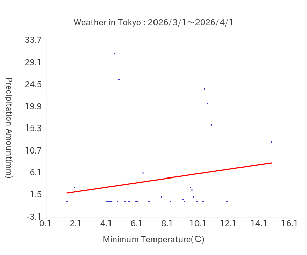</a> 

Properties

- count: 32
- x: 
	- Mean: 7.365625
	- Max: 14.9
	- Min: 1.5
	- Variance: 9.417880859375
	- StandardDeviation: 3.0688566045638
- y: 
	- Mean: 4.5625
	- Max: 31
	- Min: 0
	- Variance: 74.76171875
	- StandardDeviation: 8.6464859191466
- Covariance: 4.3943359375
- CorrelationCoefficient: 0.16560636326303
- RegressionLineFormula: 
	- a: 0.46659498066656
	- b: 1.1257363455279

</td>
<td><a href="img/Matrix11.png">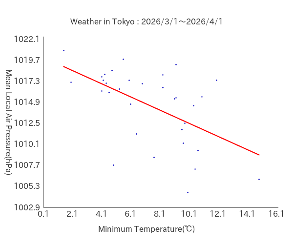</a> 

Properties

- count: 32
- x: 
	- Mean: 7.365625
	- Max: 14.9
	- Min: 1.5
	- Variance: 9.417880859375
	- StandardDeviation: 3.0688566045638
- y: 
	- Mean: 1014.55625
	- Max: 1020.8
	- Min: 1004.6
	- Variance: 17.8293359375
	- StandardDeviation: 4.2224798326931
- Covariance: -7.09744140625
- CorrelationCoefficient: -0.54771878463843
- RegressionLineFormula: 
	- a: -0.75361342028285
	- b: 1020.1070838488

</td>
</tr>
<tr><td>Sunshine Hours(h)</td>
<td>-</td>
<td>-</td>
<td>-</td>
<td>-</td>
<td><a href="img/Matrix12.png">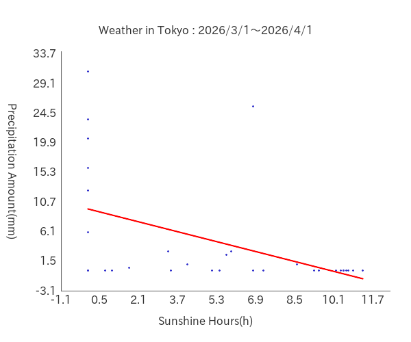</a> 

Properties

- count: 32
- x: 
	- Mean: 5.3
	- Max: 11.3
	- Min: 0
	- Variance: 17.759375
	- StandardDeviation: 4.2141873475203
- y: 
	- Mean: 4.5625
	- Max: 31
	- Min: 0
	- Variance: 74.76171875
	- StandardDeviation: 8.6464859191466
- Covariance: -17.03125
- CorrelationCoefficient: -0.46740466921376
- RegressionLineFormula: 
	- a: -0.9590005278902
	- b: 9.6452027978181

</td>
<td><a href="img/Matrix13.png">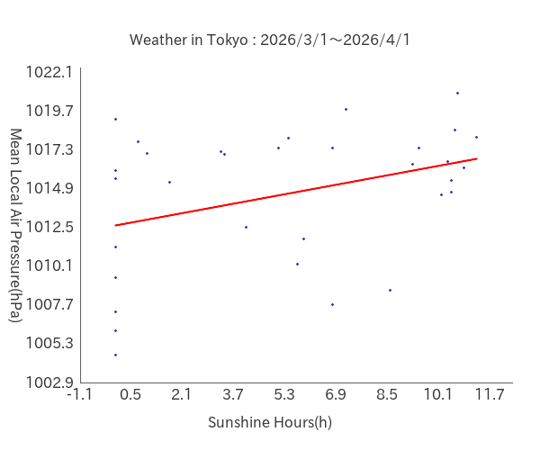</a> 

Properties

- count: 32
- x: 
	- Mean: 5.3
	- Max: 11.3
	- Min: 0
	- Variance: 17.759375
	- StandardDeviation: 4.2141873475203
- y: 
	- Mean: 1014.55625
	- Max: 1020.8
	- Min: 1004.6
	- Variance: 17.8293359375
	- StandardDeviation: 4.2224798326931
- Covariance: 6.49125
- CorrelationCoefficient: 0.36479335000157
- RegressionLineFormula: 
	- a: 0.36551117367588
	- b: 1012.6190407795

</td>
</tr>
<tr><td>Precipitation Amount(mm)</td>
<td>-</td>
<td>-</td>
<td>-</td>
<td>-</td>
<td>-</td>
<td><a href="img/Matrix14.png">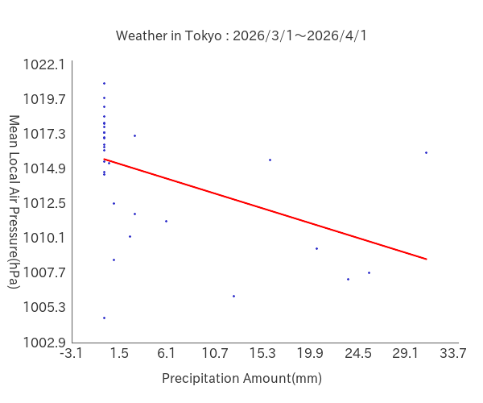</a> 

Properties

- count: 32
- x: 
	- Mean: 4.5625
	- Max: 31
	- Min: 0
	- Variance: 74.76171875
	- StandardDeviation: 8.6464859191466
- y: 
	- Mean: 1014.55625
	- Max: 1020.8
	- Min: 1004.6
	- Variance: 17.8293359375
	- StandardDeviation: 4.2224798326931
- Covariance: -16.728515625
- CorrelationCoefficient: -0.45819482918123
- RegressionLineFormula: 
	- a: -0.22375777208841
	- b: 1015.5771448352

</td>
</tr>
<tr><td>Mean Local Air Pressure(hPa)</td>
<td>-</td>
<td>-</td>
<td>-</td>
<td>-</td>
<td>-</td>
<td>-</td>
</tr>
</table>
