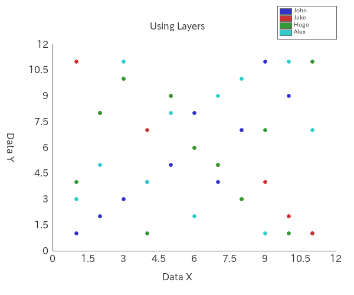

# PHP-Scatterplot : Using Layers

Layers

|#|John: x|John: y|Jake: x|Jake: y|Hugo: x|Hugo: y|Alex: x|Alex: y|
|:---:|:---:|:---:|:---:|:---:|:---:|:---:|:---:|:---:|
|0|1|1|1|11|1|4|1|3|
|1|2|2|2|8|2|8|2|5|
|2|3|3|3|10|3|10|3|11|
|3|4|4|4|7|4|1|4|4|
|4|5|5|5|9|5|9|5|8|
|5|6|8|6|6|6|6|6|2|
|6|7|4|7|5|7|5|7|9|
|7|8|7|8|3|8|3|8|10|
|8|9|11|9|4|9|7|9|1|
|9|10|9|10|2|10|1|10|11|
|10|11|1|11|1|11|11|11|7|

Regression Line Formula

- John: y = 0.51818181818182 x + 1.8909090909091
- Jake: y = -0.94545454545455 x + 11.672727272727
- Hugo: y = -0.018181818181818 x + 6.0181818181818
- Alex: y = 0.24545454545455 x + 4.9818181818182

